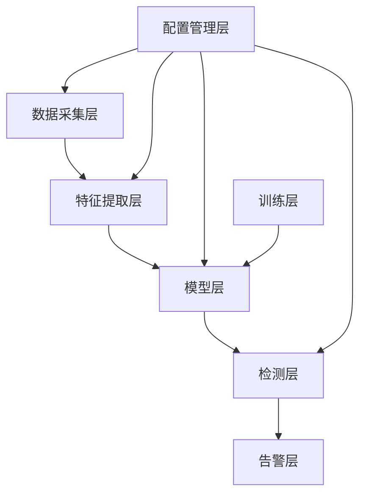

# API参考文档

## 1. 系统架构概述

异常检测系统采用模块化设计，包含以下核心模块：

1. **数据采集模块** (`src/capture/`) - 实时捕获和解析网络数据包
2. **特征提取模块** (`src/features/`) - 从原始流量中提取统计和时序特征
3. **模型模块** (`src/models/`) - 提供多种机器学习模型实现
4. **训练模块** (`src/training/`) - 实现模型训练、评估和优化逻辑
5. **检测模块** (`src/detection/`) - 执行实时异常检测
6. **配置管理模块** (`src/config/`) - 管理系统配置参数
7. **工具模块** (`src/utils/`) - 提供通用工具函数



## 2. 数据采集模块（`src/capture/`）

### 2.1 `PacketCapture`类
**功能**：基于libpcap库捕获网络数据包。

#### 初始化
```python
from src.capture.packet_capture import PacketCapture

# 基本初始化
capture = PacketCapture(
    interface: str = "eth0",     # 网络接口
    bpf_filter: str = "",        # BPF过滤规则
    buffer_size: int = 1048576,  # 缓冲区大小(字节)
    snaplen: int = 65535,        # 最大捕获长度
    promiscuous: bool = False    # 混杂模式
)
```

#### 核心方法
```python
def start_capture(self) -> None:
    """开始捕获数据包"""

def stop_capture(self) -> None:
    """停止捕获数据包"""

def set_packet_handler(self, handler: Callable[[dict], None]) -> None:
    """
    设置数据包处理回调函数
    
    参数:
        handler: 回调函数，接收解析后的数据包字典
    """

def get_capture_stats(self) -> Dict[str, int]:
    """获取捕获统计信息"""
```

### 2.2 `TrafficAnalyzer`类
**功能**：协调数据包捕获和会话跟踪流程。

#### 初始化
```python
from src.capture.traffic_analyzer import TrafficAnalyzer

analyzer = TrafficAnalyzer(
    packet_capture: PacketCapture,    # 数据包捕获器
    session_tracker: SessionTracker,  # 会话跟踪器
    stat_extractor: StatFeatureExtractor,    # 统计特征提取器
    temporal_extractor: TemporalFeatureExtractor  # 时序特征提取器
)
```

#### 核心方法
```python
def start_analysis(self) -> None:
    """启动流量分析"""

def stop_analysis(self) -> None:
    """停止流量分析"""

def get_analysis_stats(self) -> Dict[str, Any]:
    """获取分析统计信息"""
```

## 3. 特征提取模块（`src/features/`）

### 3.1 `StatFeatureExtractor`类
**功能**：提取流量的统计特征。

#### 初始化
```python
from src.features.stat_extractor import StatFeatureExtractor

extractor = StatFeatureExtractor(
    config: ConfigManager = None  # 配置管理器
)
```

#### 核心方法
```python
def extract_features(self, session_data: Dict[str, Any]) -> Dict[str, float]:
    """
    从会话数据中提取统计特征
    
    参数:
        session_data: 会话数据字典
        
    返回:
        特征字典
    """
```

### 3.2 `TemporalFeatureExtractor`类
**功能**：提取流量的时序特征。

#### 初始化
```python
from src.features.temporal_extractor import TemporalFeatureExtractor

extractor = TemporalFeatureExtractor(
    window_size: int = 60,   # 时间窗口大小(秒)
    window_step: int = 10    # 窗口步长(秒)
)
```

#### 核心方法
```python
def extract_features(self, packet_stream: List[Dict]) -> Dict[str, float]:
    """
    从数据包流中提取时序特征
    
    参数:
        packet_stream: 数据包流列表
        
    返回:
        时序特征字典
    """
```

## 4. 模型模块（`src/models/`）

### 4.1 `BaseModel`抽象类
**功能**：所有模型的基类，定义统一接口（训练/预测/评估）。

#### 核心方法
```python
from src.models.base_model import BaseModel

# 所有模型均实现以下接口
def fit(self, X: np.ndarray, y: np.ndarray, **kwargs) -> None:
    """
    训练模型
    
    参数:
        X: 特征矩阵（n_samples × n_features）
        y: 标签数组（0=正常，1=异常）
       ** kwargs: 训练参数（如epochs、batch_size）
    """

def predict(self, X: np.ndarray) -> np.ndarray:
    """
    预测标签
    
    返回: 预测结果数组（0或1）
    """

def predict_proba(self, X: np.ndarray) -> np.ndarray:
    """
    预测异常概率
    
    返回: 概率数组（形状为(n_samples, 2)，[:,1]为异常概率）
    """

def save(self, file_path: str) -> None:
    """保存模型至指定路径"""

@classmethod
def load(cls, file_path: str) -> BaseModel:
    """从文件加载模型"""
```

### 4.2 `ModelFactory`类
**功能**：模型创建工厂，支持动态加载和管理多种模型。

#### 初始化
```python
from src.models.model_factory import ModelFactory

factory = ModelFactory(
    config: ConfigManager = None  # 配置管理器
)
```

#### 核心方法
```python
def create_model(self, model_type: str, **kwargs) -> BaseModel:
    """
    创建指定类型的模型实例
    
    参数:
        model_type: 模型类型（如"xgboost"）
        **kwargs: 模型参数
        
    返回:
        模型实例
    """

def load_latest_model(self, model_type: str) -> Optional[BaseModel]:
    """
    加载指定类型的最新模型
    
    参数:
        model_type: 模型类型
        
    返回:
        模型实例或None
    """

def save_model(self, model: BaseModel, model_type: str) -> str:
    """
    保存模型并更新最新模型链接
    
    参数:
        model: 模型实例
        model_type: 模型类型
        
    返回:
        模型保存路径
    """
```

### 4.3 `ModelSelector`类
**功能**：基于协议类型与历史性能自动选择最优模型。

#### 核心方法
```python
from src.models.model_selector import ModelSelector

selector = ModelSelector()

def select_best_model(self, protocol: Union[str, int]) -> str:
    """
    为指定协议选择最优模型
    
    参数:
        protocol: 协议名称（如"tcp"）或编号（如6）
    
    返回:
        最优模型类型（如"lstm"）
    """

def update_performance(self, protocol: Union[str, int], model_type: str, metrics: Dict[str, float]) -> None:
    """
    更新模型性能记录（用于后续选择）
    
    参数:
        metrics: 性能指标，含"f1"、"precision"、"recall"等
    """
```

## 5. 异常检测模块（`src/detection/`）

### 5.1 `AnomalyDetector`类
**功能**：结合模型预测与规则引擎检测异常流量。

#### 初始化
```python
from src.detection.anomaly_detector import AnomalyDetector

detector = AnomalyDetector(
    threshold: float = 0.8,  # 异常判定阈值（概率≥此值视为异常）
    mode: str = "hybrid"    # 检测模式："model"/"rule"/"hybrid"
)
```

#### 核心方法
```python
def detect(self, features: Dict[str, float]) -> Tuple[bool, float]:
    """
    检测异常流量
    
    参数:
        features: 特征字典（来自特征提取模块）
    
    返回:
        (是否异常, 异常概率)
    """
```

### 5.2 `AlertManager`类
**功能**：处理异常检测结果，触发日志记录与告警通知。

#### 核心方法
```python
from src.detection.alert_manager import AlertManager

alert_manager = AlertManager()

def trigger_alert(self, features: Dict[str, float], score: float, session_id: str) -> None:
    """
    触发异常告警
    
    参数:
        features: 特征字典
        score: 异常概率
        session_id: 会话ID
    """
```

## 6. 训练模块（`src/training/`）

### 6.1 `ContinuousTrainer`类
**功能**：实现持续训练逻辑，自动检测新数据并更新模型。

#### 核心方法
```python
from src.training.continuous_trainer import ContinuousTrainer

trainer = ContinuousTrainer()

def start(self, check_interval: int = 3600, min_samples: int = 1000) -> None:
    """
    启动持续训练进程
    
    参数:
        check_interval: 检查新数据的时间间隔（秒）
        min_samples: 触发训练的最小新样本数
    """

def trigger_manual_training(self, model_type: str, protocol: Optional[int] = None) -> Tuple[bool, str]:
    """
    手动触发模型训练
    
    参数:
        model_type: 模型类型
        protocol: 协议编号（None表示通用模型）
    
    返回:
        (训练是否成功, 结果信息)
    """
```

### 6.2 `ModelTrainer`类
**功能**：基础训练逻辑，支持交叉验证与模型评估。

#### 核心方法
```python
from src.training.model_trainer import ModelTrainer

trainer = ModelTrainer(model_factory=ModelFactory())

def train_new_model(self, model_type: str, X: np.ndarray, y: np.ndarray) -> Tuple[BaseModel, Dict[str, float]]:
    """
    训练新模型
    
    参数:
        model_type: 模型类型
        X: 特征矩阵
        y: 标签数组
    
    返回:
        (训练好的模型, 评估指标)
    """
```

### 6.3 `FeedbackOptimizer`类
**功能**：根据模型评估结果优化特征工程和模型训练。

#### 核心方法
```python
from src.training.feedback_optimizer import FeedbackOptimizer

optimizer = FeedbackOptimizer()

def optimize_based_on_evaluation(
    self,
    model_type: str,
    evaluation_metrics: Dict[str, float],
    protocol: Optional[int] = None,
    feature_importance: Optional[Dict[str, float]] = None,
    model_factory=None
) -> Dict[str, Any]:
    """
    根据模型评估结果进行优化
    
    参数:
        model_type: 模型类型
        evaluation_metrics: 评估指标
        protocol: 协议编号
        feature_importance: 特征重要性
        model_factory: 模型工厂
        
    返回:
        优化建议和执行结果
    """

def get_feature_ranking(self) -> List[Tuple[str, float]]:
    """
    获取特征重要性排名
    
    返回:
        按重要性排序的特征列表
    """

def suggest_feature_engineering(self) -> List[str]:
    """
    基于历史性能建议特征工程优化
    
    返回:
        优化建议列表
    """
```

## 7. 配置管理（`src/config/`）

### 7.1 `ConfigManager`类
**功能**：管理系统配置参数，支持动态读写配置文件。

#### 核心方法
```python
from src.config.config_manager import ConfigManager

config = ConfigManager()

def get(self, key: str, default: Any = None) -> Any:
    """
    获取配置参数
    
    参数:
        key: 参数键（支持点语法，如"model.threshold"）
        default: 默认值
    """

def set(self, key: str, value: Any) -> None:
    """更新配置参数"""
```

## 8. 工具函数（`src/utils/`）

### 8.1 指标计算
```python
from src.utils.metrics import (
    calculate_precision,     # 计算精确率
    calculate_recall,        # 计算召回率
    calculate_f1,           # 计算F1分数
    calculate_auc,           # 计算AUC值
    calculate_confusion_matrix  # 计算混淆矩阵
)
```

### 8.2 可视化工具
```python
from src.utils.evaluation_visualizer import EvaluationVisualizer

visualizer = EvaluationVisualizer(output_dir="plots/")

def plot_roc_curve(self, y_true: np.ndarray, y_score: np.ndarray) -> str:
    """绘制ROC曲线并返回保存路径"""

def plot_confusion_matrix(self, cm: np.ndarray) -> str:
    """绘制混淆矩阵热图"""
```


## 9. 命令行接口（CLI）

系统提供统一的命令行接口，所有操作均通过`anomaly-detector`命令执行。

### 9.1 系统管理命令

#### 初始化系统
```bash
anomaly-detector init
```

#### 启动系统
```bash
anomaly-detector start
```

#### 停止系统
```bash
anomaly-detector stop
```

#### 查看系统状态
```bash
anomaly-detector status
```

### 9.2 模型训练命令

#### 单次训练
```bash
anomaly-detector train once
```

#### 持续训练
```bash
anomaly-detector train continuous
```

#### 评估模型
```bash
anomaly-detector train evaluate
```

#### 优化模型
```bash
anomaly-detector train optimize
```

#### AutoML训练
```bash
anomaly-detector train automl
```

### 9.3 模型管理命令

#### 查看模型列表
```bash
anomaly-detector models list
```

#### 切换模型版本
```bash
anomaly-detector models use --type xgboost --version 20230615_1230
```

### 9.4 告警管理命令

#### 查看告警列表
```bash
anomaly-detector alerts list
```

#### 处理告警反馈
```bash
anomaly-detector alerts feedback --alert-id ALERT_12345 --correct
```

## 10. 错误处理与日志

所有API方法均会抛出以下异常（需捕获处理）：
- `ValueError`：参数无效或数据格式错误
- `FileNotFoundError`：模型/配置文件不存在
- `RuntimeError`：运行时错误（如训练失败）

日志可通过`src.utils.logger`模块获取，按模块分类输出至`logs/`目录。