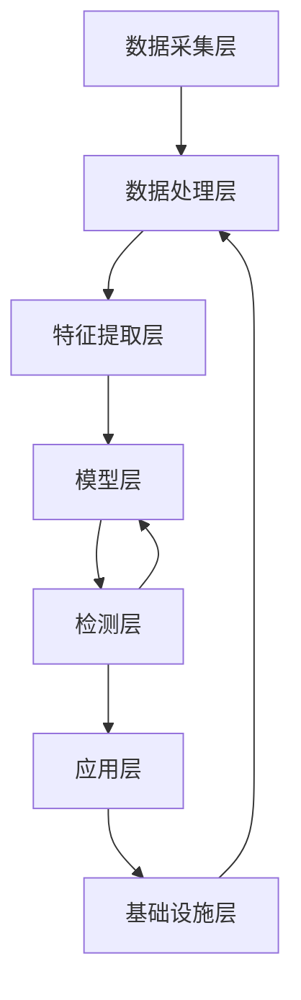
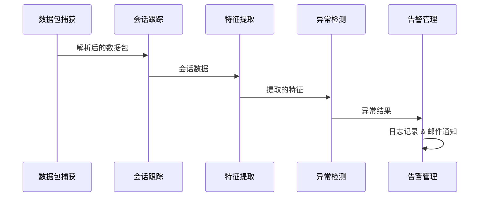
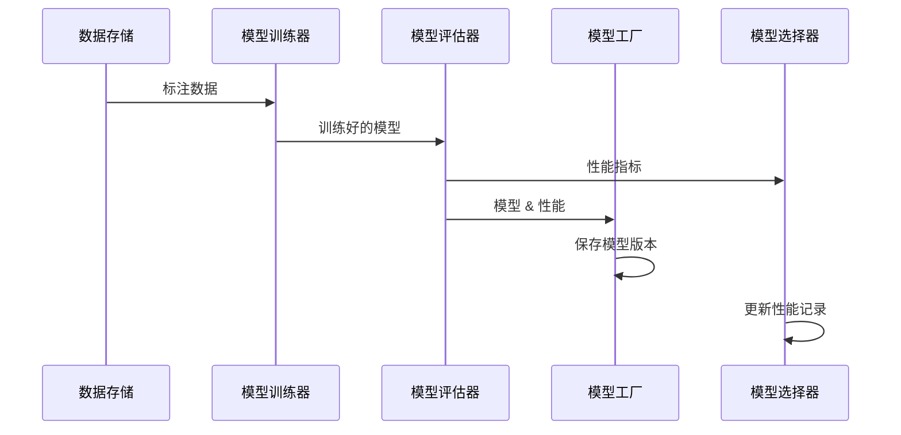

### `docs/architecture.md`（系统架构说明）

```markdown
# 异常检测系统架构设计

## 1. 系统概述

本异常检测系统是一个基于机器学习的实时网络流量分析平台，能够自动识别网络中的异常行为和潜在威胁。系统采用模块化设计，支持从数据包捕获、特征提取、模型训练到异常告警的全流程自动化处理，适用于企业内网、数据中心等多种网络环境。

系统核心优势：
- 实时性：毫秒级流量分析与异常检测
- 准确性：结合传统机器学习与深度学习模型
- 自适应性：通过持续学习适应新的网络威胁
- 可扩展性：模块化设计便于功能扩展和定制化开发

## 2. 整体架构

系统采用分层架构设计，共分为6个核心层次，各层次通过标准化接口交互，形成完整的异常检测闭环：



- **数据采集层**：负责网络数据包的捕获与解析
- **数据处理层**：处理和存储原始数据与特征数据
- **特征提取层**：从原始流量中提取有价值的特征
- **模型层**：提供模型训练、推理和管理功能
- **检测层**：执行异常检测并触发告警
- **应用层**：提供用户交互接口和告警展示
- **基础设施层**：提供配置管理、日志、监控等支撑功能

## 3. 核心模块详解

### 3.1 数据采集层

**功能**：实时捕获网络流量并解析为结构化数据

**核心组件**：
- `packet_capture.py`：基于libpcap库捕获网络数据包，支持BPF过滤规则
- `session_tracker.py`：维护网络会话状态，聚合数据包信息
- `traffic_analyzer.py`：协调数据包捕获和会话跟踪流程

**关键流程**：
1. 监听指定网络接口（如eth0）
2. 应用BPF过滤规则（可选）
3. 解析数据包为IP/TCP/UDP/ICMP等协议结构
4. 按五元组（源IP、源端口、目的IP、目的端口、协议）聚合为会话
5. 计算会话级统计信息（包数、字节数、持续时间等）

### 3.2 数据处理层

**功能**：存储、清洗和管理流量数据与特征数据

**核心组件**：
- `data_storage.py`：提供数据持久化存储功能
- `data_processor.py`：数据清洗、转换和标准化
- `data_generator.py`：生成训练所需的标注数据集

**数据存储结构**：
- 原始数据包：按时间分区存储，保留完整协议信息
- 会话数据：包含会话元数据和统计信息
- 特征数据：提取的特征向量，用于模型训练和推理
- 标注数据：包含正常/异常标签的数据，用于模型训练

### 3.3 特征提取层

**功能**：从原始流量和会话数据中提取有区分度的特征

**核心组件**：
- `stat_extractor.py`：提取统计特征
- `temporal_extractor.py`：提取时序特征
- `protocol_specs.py`：定义各协议的特征提取规则

**特征类型**：
- 统计特征：包大小分布、协议类型占比、TCP标志位组合等
- 时序特征：包到达间隔、流量速率变化、突发检测等
- 协议专属特征：TCP重传率、UDP payload熵值、ICMP类型分布等
- 聚合特征：多时间窗口（10s/60s/300s）的特征聚合

### 3.4 模型层

**功能**：提供模型训练、推理和管理能力

**核心组件**：
- `base_model.py`：模型基类，定义统一接口
- `traditional_models.py`：传统机器学习模型（XGBoost、随机森林等）
- `deep_models.py`：深度学习模型（LSTM、MLP等）
- `model_factory.py`：模型创建、保存和加载的工厂类
- `model_selector.py`：基于协议类型选择最优模型

**模型管理**：
- 版本控制：每个模型版本保留训练参数和性能指标
- 协议适配：为不同协议类型选择最优模型（如TCP用LSTM，UDP用XGBoost）
- 持续更新：通过增量训练不断优化模型性能

### 3.5 检测层

**功能**：基于模型或规则识别异常流量并触发告警

**核心组件**：
- `anomaly_detector.py`：异常检测核心逻辑
- `alert_manager.py`：告警生成和分发
- `feedback_processor.py`：处理人工反馈，优化检测策略

**检测策略**：
- 模型检测：基于机器学习模型预测异常概率
- 规则检测：基于预定义规则（包大小阈值、异常协议等）
- 混合检测：结合模型和规则，提高检测准确性

### 3.6 应用层与基础设施层

**应用层**：
- `cli/`：命令行接口，支持系统操作和配置
- `webui/`：可选的Web界面，提供可视化展示（未实现）

**基础设施层**：
- `config_manager.py`：配置文件管理
- `logger.py`：日志记录和管理
- `monitor.py`：系统资源监控
- `system_manager.py`：组件生命周期管理

## 4. 核心业务流程

### 4.1 实时检测流程



1. 数据包捕获模块实时捕获并解析网络流量
2. 会话跟踪模块聚合数据包，形成网络会话
3. 特征提取模块从会话中提取统计和时序特征
4. 异常检测模块使用模型预测异常概率
5. 当异常概率超过阈值时，告警管理模块触发告警

### 4.2 模型训练流程



1. 数据存储模块提供标注数据（正常/异常）
2. 模型训练器进行交叉验证训练
3. 模型评估器计算性能指标（精确率、召回率、F1等）
4. 模型工厂保存模型及版本信息
5. 模型选择器更新性能记录，用于后续模型选择

## 5. 系统部署架构

系统支持单机部署和分布式部署两种模式：

- **单机部署**：所有模块运行在同一主机，适用于中小规模网络
- **分布式部署**：各模块可部署在不同主机，通过消息队列通信，适用于大规模网络

最小系统需求：
- CPU：4核及以上
- 内存：8GB及以上
- 存储：至少100GB可用空间
- 操作系统：Linux（推荐Ubuntu 20.04+）
```
