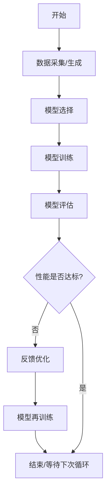

# 自驱动自学习闭环系统

## 简介

自驱动自学习闭环系统是本项目的核心功能之一，它实现了从数据采集、模型训练、模型评估、反馈优化到模型再训练的完整闭环流程。该系统能够自动监控数据变化，根据模型性能自动优化特征工程和模型参数，并在必要时触发再训练，形成一个完全自动化的机器学习流程。

## 系统架构

自驱动学习系统包含以下主要组件：

1. **数据采集/生成模块** - 负责收集新的训练数据或生成模拟数据
2. **模型选择模块** - 根据数据特征自动选择最适合的模型类型
3. **模型训练模块** - 执行模型训练过程
4. **模型评估模块** - 对训练好的模型进行全面评估
5. **反馈优化模块** - 根据评估结果优化特征工程和模型参数
6. **再训练决策模块** - 根据评估结果决定是否需要重新训练模型

## 工作流程



## 数据采集来源

系统支持多种数据采集来源，按照配置中的优先级顺序尝试：

### 1. 文件数据源 (file)
从 [data/processed](file:///repo/ethernet-anomaly-detection/data/processed) 目录加载现有的CSV格式训练数据。

### 2. 模拟数据生成 (generated)
当没有现成数据时，使用 [DataGenerator](file:///repo/ethernet-anomaly-detection/src/data/data_generator.py#L25-L257) 生成模拟网络流量数据，包含正常流量和多种异常流量。

### 3. 实时网络捕获 (capture)
直接从网络接口捕获实时流量数据，需要配置网络接口权限。

### 4. pcap文件 (pcap)
从 [data/pcap](file:///repo/ethernet-anomaly-detection/data/pcap) 目录加载pcap格式的网络流量捕获文件。

## 使用方法

### 启动自驱动学习系统

使用以下命令启动自驱动学习系统：

```bash
anomaly-detector train self-driving
```

要以后台模式运行，可以添加 `-b` 参数：

```bash
anomaly-detector train self-driving -b
```

### 配置参数

自驱动学习系统的配置参数位于 `config/config.yaml` 文件中的 `training.self_driving` 部分：

```yaml
training:
  self_driving:
    data_check_interval: 3600     # 数据检查间隔（秒）
    min_new_samples: 1000         # 触发训练的最小新样本数
    max_history_days: 30          # 使用的最大历史数据天数
    evaluation_threshold: 0.75    # 模型性能阈值
    retrain_interval: 259200      # 再训练间隔（秒）
    # 数据源优先级列表，支持: file(文件), generated(生成), capture(实时捕获), pcap(pcap文件)
    data_sources: 
      - file
      - generated
      - capture
      - pcap
```

网络捕获相关配置位于 `capture` 部分：

```yaml
capture:
  # 默认网络接口
  interface: eth0
  # 实时捕获配置
  realtime:
    buffer_size: 65536
    promiscuous: true
    timeout: 100
  # 自驱动系统捕获配置
  self_driving_capture_duration: 60
  # BPF过滤规则
  filter: ""
```

## 系统特点

### 1. 自动化程度高

系统能够自动完成从数据采集到模型优化的整个流程，无需人工干预。

### 2. 智能模型选择

根据数据特征（样本数量、特征维度等）自动选择最适合的模型类型。

### 3. 动态优化

基于模型评估结果，系统能够自动优化特征工程和模型参数。

### 4. 闭环学习

系统形成完整的训练-评估-优化-再训练闭环，持续提升模型性能。

### 5. 可配置性强

所有关键参数都可以通过配置文件进行调整，适应不同场景需求。

### 6. 多数据源支持

支持多种数据采集方式，适应不同部署环境。

### 7. 灵活的异常类型分布

在生成模拟数据时，系统支持自定义异常类型及其分布比例，可以精确控制训练数据中各种异常类型的占比。

## 性能监控

系统会记录每次学习周期的详细信息，包括：

- 数据采集状态
- 模型选择结果
- 训练过程指标
- 评估结果
- 优化建议
- 再训练决策

这些信息可以通过日志查看，也可以通过系统接口获取。

## 扩展性

系统设计具有良好的扩展性，可以方便地添加：

1. 新的数据源接入方式
2. 新的模型类型支持
3. 更复杂的优化策略
4. 更智能的再训练触发机制

## 最佳实践

1. **定期检查日志** - 监控系统运行状态和性能变化
2. **调整配置参数** - 根据实际业务需求调整检查间隔和阈值
3. **监控资源使用** - 注意系统运行时的CPU和内存使用情况
4. **备份重要模型** - 定期备份性能优秀的模型版本
5. **配置数据源优先级** - 根据实际环境调整数据源优先级列表
6. **设置合适的捕获时长** - 为实时捕获设置合适的时长，避免影响系统性能
7. **自定义异常类型分布** - 根据实际网络环境中的威胁类型分布，调整模拟数据中异常类型的占比